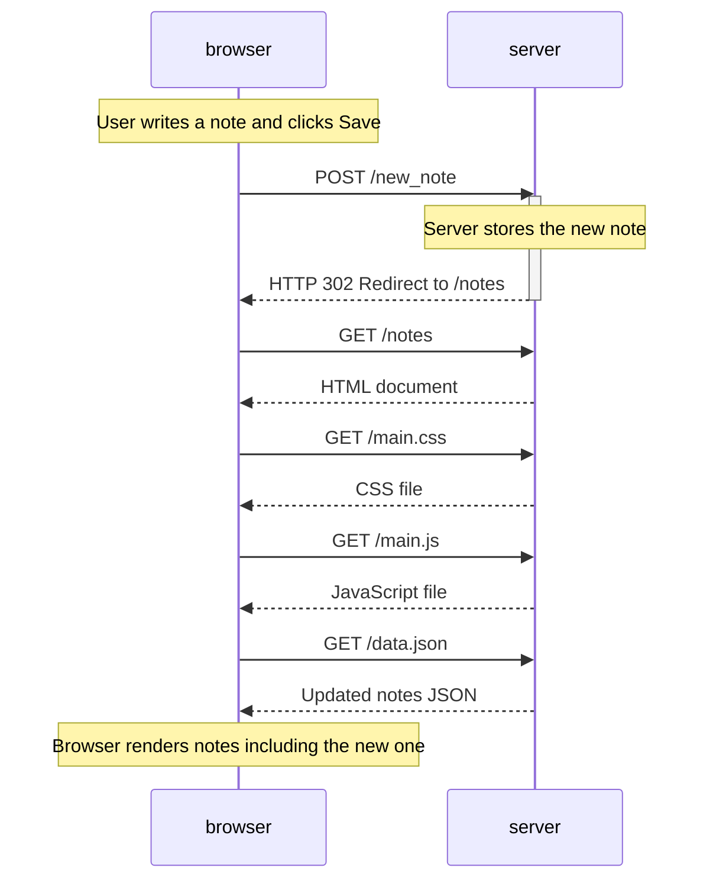

```mermaid
sequenceDiagram
    participant browser
    participant server

    Note over browser: User writes a note and clicks Save

    browser->>server: POST /new_note
    activate server
    Note over server: Server stores the new note
    server-->>browser: HTTP 302 Redirect to /notes
    deactivate server

    browser->>server: GET /notes
    server-->>browser: HTML document

    browser->>server: GET /main.css
    server-->>browser: CSS file

    browser->>server: GET /main.js
    server-->>browser: JavaScript file

    browser->>server: GET /data.json
    server-->>browser: Updated notes JSON

    Note over browser: Browser renders notes including the new one
```
