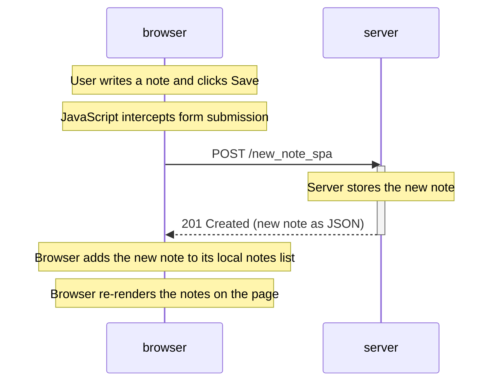

```mermaid
sequenceDiagram
    participant browser
    participant server

    Note over browser: User writes a note and clicks Save

    Note over browser: JavaScript intercepts form submission

    browser->>server: POST /new_note_spa
    activate server
    Note over server: Server stores the new note
    server-->>browser: 201 Created (new note as JSON)
    deactivate server

    Note over browser: Browser adds the new note to its local notes list
    Note over browser: Browser re-renders the notes on the page

```